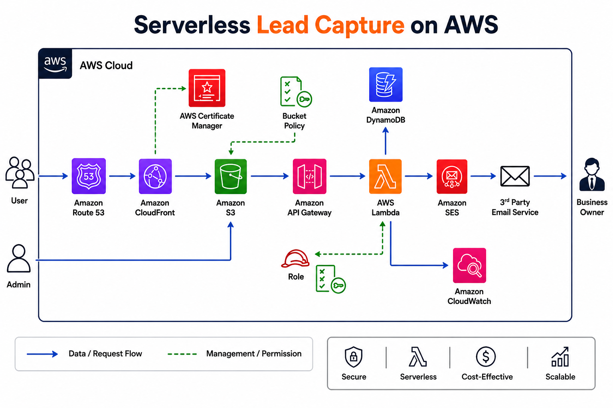

# Serverless Lead Capture on AWS 📚

A fully serverless lead capture platform built on AWS and managed entirely with Terraform (IaC). Hosts a static ebook landing page via S3 + CloudFront for global CDN delivery, routes traffic through Route 53 with HTTPS enforced via ACM, captures leads through API Gateway + Lambda, persists contact data in DynamoDB, and triggers email notifications via SES. All infrastructure is provisioned and managed as code using Terraform HCL.

**Live Site:** [epicreads.rsuggs.dev](https://epicreads.rsuggs.dev)

---

## Architecture Diagram



---

## Architecture Overview

| Layer | Service |
|---|---|
| DNS & Domain | Route 53 |
| CDN & HTTPS | CloudFront + ACM |
| Static Hosting | S3 (OAC bucket policy) |
| API Layer | API Gateway (REST API) |
| Business Logic | AWS Lambda (Node.js 20.x) |
| Database | DynamoDB |
| Email Notifications | SES |
| Monitoring | CloudWatch |
| Infrastructure as Code | Terraform |

---

## Customer Requirements

- Static website built with HTML, CSS, and JavaScript
- Users can download an eBook directly from the site
- Contact details captured and stored in DynamoDB for analytics
- Email notification triggered on every form submission via SES
- Global customer base — CloudFront CDN used for low-latency delivery
- ~500 active users, 10–15 downloads per day
- All requests served over HTTPS
- Custom domain: `epicreads.rsuggs.dev`

---

## Traffic Flow

```
User's Browser
      ↓
Route 53 A Record (epicreads.rsuggs.dev → CloudFront)
      ↓
CloudFront Distribution (terminates HTTPS using ACM certificate)
      ↓
S3 Bucket (serves static site files via OAC)

Form Submission Flow:
      ↓
API Gateway (REST API — POST /contact)
      ↓
AWS Lambda (parses body, writes to DynamoDB, sends email via SES)
      ↓
DynamoDB (stores lead data) + SES (emails site owner)
```

---

## Project Walkthrough

### Phase 1: Hosting the Static Website

1. **S3 Bucket** — Created an S3 bucket (`epicreads-roberts-v3`) and uploaded the static Ebook site files using Terraform's `aws_s3_object` resource with `fileset` to iterate over all files and set correct MIME types via `content_type` lookup.

2. **ACM Certificate** — Requested a public SSL/TLS certificate for `epicreads.rsuggs.dev` using AWS Certificate Manager with DNS validation and RSA_2048 key algorithm. DNS validation CNAME records were created automatically in Route 53 by Terraform.

3. **Route 53 Hosted Zone** — Registered `rsuggs.dev` through the AWS Console (domain registration is not supported via Terraform for initial purchase). The hosted zone was automatically created on registration and imported into Terraform state using an `import` block.

4. **CloudFront Distribution** — Configured CloudFront with the S3 bucket as the origin using Origin Access Control (OAC), ensuring the bucket is not publicly accessible and all traffic flows through CloudFront. The distribution is aliased to `epicreads.rsuggs.dev`, uses `redirect-to-https` for all viewer requests, and is attached to the ACM certificate for TLS termination.

5. **Route 53 A Record** — Created an alias A record pointing `epicreads.rsuggs.dev` to the CloudFront distribution domain name.

---

### Phase 2: Serverless Lead Capture Endpoint

6. **SES Identities** — Created two verified SES email identities (sender and receiver) managed as `aws_ses_email_identity` resources with email addresses stored in `terraform.tfvars` and passed in as variables.

7. **IAM Role & Policy** — Created `Epicreads_role` with a trust policy scoped to Lambda and `Epicreads_SES_policy` granting permissions for CloudWatch Logs (`CreateLogGroup`, `CreateLogStream`, `PutLogEvents`), SES (`SendEmail`, `SendRawEmail`), and DynamoDB (`PutItem`). The policy was written directly in Terraform using `jsonencode()` and attached to the role via `aws_iam_role_policy_attachment`.

8. **Lambda Function** — Created `epicreads_contactus` using Node.js 20.x. The function parses the API Gateway proxy event body, validates required fields, writes the submission to DynamoDB, and sends an email notification via SES. Sender/receiver emails and DynamoDB table name are injected as environment variables from Terraform. The `source_code_hash` attribute ensures Terraform automatically redeploys the function when the code changes.

9. **API Gateway** — Built a REST API (`EpicReads_api`) with a regional IPv4 endpoint. Created a `/contact` resource with a POST method integrated with the Lambda function using `AWS_PROXY` integration. CORS is enabled via an OPTIONS method with a MOCK integration that returns the required `Access-Control-Allow-*` headers. The API is deployed to a `prod` stage with throttling applied via `aws_api_gateway_method_settings` (10 req/sec sustained, burst of 5) to protect against abuse.

10. **Frontend Integration** — Updated `index.html` with a JavaScript fetch handler that submits the contact form to the API Gateway invoke URL and displays a success/error alert to the user.

---

### Phase 3: Data Persistence

11. **DynamoDB Table** — Created `ContactMessages` table with a `String` partition key (`id`) and `PAY_PER_REQUEST` billing mode. Each form submission is stored with `id` (UUID), `name`, `phone`, `email`, `message`, and `createdAt` timestamp fields.

---

## Key Technical Decisions

- **OAC over public S3** — Used Origin Access Control instead of a public bucket so the S3 URL is never directly accessible. All traffic must flow through CloudFront.
- **Subdomain-per-project structure** — `epicreads.rsuggs.dev` keeps this project isolated under the root domain, leaving `rsuggs.dev` free for a personal portfolio site.
- **Underscores in Terraform resource labels** — Terraform dot-notation references break with hyphens in resource labels. All resource labels use underscores while AWS resource names (bucket names, etc.) retain hyphens where needed.
- **Environment variables for sensitive config** — Email addresses and table name are passed into Lambda via Terraform environment variables rather than hardcoded in source code.
- **`terraform.tfvars` gitignored** — All sensitive values (email addresses) are stored in `terraform.tfvars` which is excluded from version control.
- **REST API over HTTP API** — Selected REST API for its support of usage plans, throttling, and advanced configuration options.
- **`AWS_PROXY` Lambda integration** — Passes the full API Gateway request to Lambda including headers and body, with Lambda responsible for returning a properly formatted response including CORS headers.

---

## What I Learned

- Provisioning and connecting core AWS services end-to-end using Terraform
- Managing DNS, SSL certificates, and CloudFront distributions as infrastructure as code
- Designing event-driven serverless workflows with Lambda, API Gateway, and DynamoDB
- Debugging static site delivery issues using Chrome DevTools Network tab
- Parsing API Gateway proxy events correctly in Node.js Lambda functions
- Using `source_code_hash` for automatic Lambda redeployment on code changes
- Importing existing AWS resources into Terraform state using `import` blocks
- Applying API Gateway throttling to protect against abuse and unexpected costs

---

## Troubleshooting Notes

### Issue 1: Terraform Resource Label Hyphens Causing Reference Errors

After renaming the S3 bucket resource label from `epicreads-roberts-v3` to `epicreads_roberts_v3` (Terraform convention), the CloudFront HCL still referenced the old hyphenated label, causing `terraform validate` to fail with `Reference to undeclared resource` errors. Terraform's dot-notation attribute access is broken by hyphens in resource labels. Fixed by renaming all labels to underscores across `S3Bucket.tf` and `CloudFront.tf` and importing the existing resources into state under the new labels.

**Key Takeaway:** Always use underscores in Terraform resource labels. The AWS resource name (e.g. `epicreads-roberts-v3`) can retain hyphens — only the Terraform label needs underscores.

---

### Issue 2: 403 Errors on CSS, JS, and Images — S3 File Path Mismatch

After `terraform apply` completed successfully, the site rendered as unstyled plain HTML with broken images. Diagnosis via Chrome DevTools Network tab revealed every asset (CSS, JS, images) was returning 403 Forbidden. The browser was requesting assets at paths like `/css/bootstrap.min.css` but files were stored in S3 under the `Ebook/` prefix (`Ebook/css/bootstrap.min.css`). CloudFront was looking for files at the wrong path and returning 403. Fixed by removing the `Ebook/` prefix from the `key` attribute in `aws_s3_object`, updating `default_root_object` to `index.html`, broadening the bucket policy `Resource` to `arn/*`, and running a CloudFront invalidation.

**Key Takeaway:** When a static site renders unstyled, check the Network tab first. 403 errors on assets point to a path or permissions issue. The `key` attribute in `aws_s3_object` controls where files land in S3 — it must align with the relative paths used inside your HTML.

---

### Issue 3: Silent Form Submission Failure — Malformed HTML Form Tag

The contact form was not triggering any API calls when the submit button was clicked. No JavaScript errors appeared in the Console tab, making this difficult to isolate. After ruling out infrastructure issues and confirming the JS event listener was targeting the correct element ID, inspection of the raw HTML revealed the `<form>` tag was being closed immediately on the same line it opened (`<form id="contact-form" ...> </form>`), placing all input fields and the submit button outside the form element. The event listener had no fields to read and the fetch call never fired. Fixed with a one-line HTML correction followed by an S3 sync and CloudFront cache invalidation.

**Key Takeaway:** Work through each layer of the stack methodically when debugging. Don't assume the issue lives in the most complex part of the system.

---

## General Debugging Checklist — S3 + CloudFront Static Sites

| Symptom | Check |
|---|---|
| Unstyled page | Network tab — look for 403/404 on CSS and JS files |
| 403 on assets | S3 file paths vs HTML relative paths, bucket policy `Resource` scope |
| 404 on everything | CloudFront `default_root_object`, Route 53 A record |
| Changes not reflecting | Run CloudFront invalidation: `aws cloudfront create-invalidation --distribution-id <ID> --paths "/*"` |
| Certificate errors | Confirm ACM cert is in `us-east-1` and fully validated before CloudFront apply |

---

## Planned Improvements

- **Read-only lead submissions dashboard** — Build a GET endpoint (API Gateway + Lambda) that scans DynamoDB with pagination and displays results in an HTML table
- **WAF integration** — Add AWS WAF in front of CloudFront for additional protection against malicious traffic

---

## Tech Stack

- **Infrastructure:** Terraform (HCL)
- **Cloud:** AWS (Route 53, CloudFront, ACM, S3, API Gateway, Lambda, DynamoDB, SES, CloudWatch, IAM)
- **Runtime:** Node.js 20.x
- **Frontend:** HTML, CSS, JavaScript (Bootstrap 5)
- **IaC Pattern:** Flat module structure with `.tfvars` for sensitive config

---

## Repository Structure

```
Serverless-Lead-Capture-AWS/
├── S3Bucket.tf
├── CloudFront.tf
├── Network.tf          # ACM, Route 53
├── IAM.tf
├── Lambda.tf
├── APIGateway.tf
├── DynamoDB.tf
├── variables.tf
├── terraform.tfvars    # gitignored — contains email addresses
├── lambda/
│   └── index.mjs       # Lambda function source
├── Ebook/              # gitignored — static site files
└── Images/
    └── Architecture_Diagram_Serverless_Lead_Capture.png
```